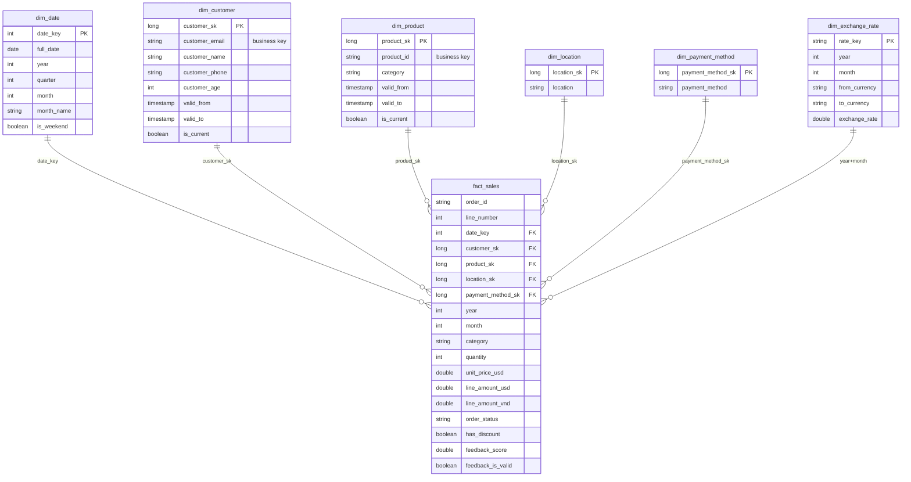

# MINDX-Mart — Gold Layer ERD (Star Schema)

Open `mindx_mart_star_schema.drawio` in [draw.io / diagrams.net](https://app.diagrams.net) to view/edit.

## Why Star Schema
A central `fact_sales` surrounded by conformed dimensions — the standard for BI/Power BI: simple
single-level joins, fast aggregations, and a direct fit for the two required reports.

The fact **grain** is **one row per item line of an order** (`order_id` + `line_number`), because the
brief needs revenue *per product category* and an order can hold several items across categories.

## Dimension types
| Dimension | Type | Key | Notes |
|---|---|---|---|
| `dim_date` | generated calendar | `date_key` (yyyyMMdd) | full 2024–2025 calendar |
| `dim_customer` | **SCD Type 2** | `customer_sk` (BK `customer_email`) | history via `valid_from/valid_to/is_current` |
| `dim_product` | **SCD Type 2** | `product_sk` (BK `product_id`) | tracks `category` changes |
| `dim_location` | SCD Type 1 | `location_sk` (BK `location`) | region/city |
| `dim_payment_method` | SCD Type 1 | `payment_method_sk` (BK `payment_method`) | standardised method |
| `dim_exchange_rate` | reference | `rate_key` (year+month+pair) | monthly USD→VND |

Every dimension carries an **Unknown member** (`sk = -1`); the fact `coalesce`s missing lookups to `-1`
so joins never drop facts.

## Relationships (1 → ∞)
```
dim_date            1 ──< fact_sales   (date_key)
dim_customer        1 ──< fact_sales   (customer_sk)
dim_product         1 ──< fact_sales   (product_sk)
dim_location        1 ──< fact_sales   (location_sk)
dim_payment_method  1 ──< fact_sales   (payment_method_sk)
dim_exchange_rate   1 ──< fact_sales   (year + month)
```

## Mermaid version (renders on GitHub)



> **Snowflake note:** `dim_product` could normalise to `dim_product → dim_category`; with only 5
> categories the extra join adds no value, so we keep a single denormalised `dim_product` (pure Star).
